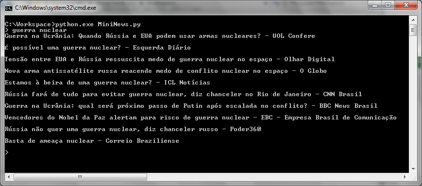
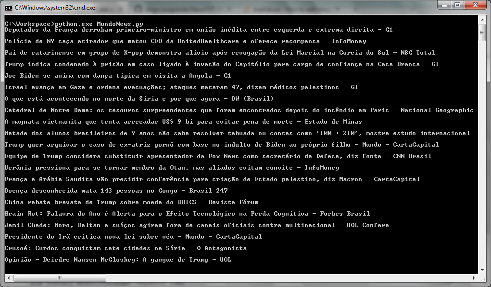

# NewsTXT-Win

Roda apartir do Windows 7 com python 3.7

Descrição:
Leia noticias do GoogleNews em modo TXT no terminal do windows


Depndencias:
```
pip install BeautifulSoup4 requests lxml
```



